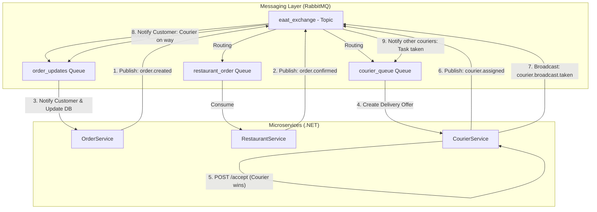

# Eaat - System Arkitektur & Dokumentation

Denne dokumentation beskriver kernesystemet i Eaat-platformen, en skalerbar microservice-løsning bygget i C# .NET med RabbitMQ som besked-motor.

## Systemoversigt

Systemet består af tre uafhængige services, der kommunikerer asynkront via en **Topic Exchange** i RabbitMQ. Dette sikrer høj skalerbarhed og robusthed (fejltolerance), hvis en del af systemet midlertidigt er nede.

### Arkitektur-diagram (Mermaid)

## Tekniske Valg & Implementering

### 1. Kommunikation (RabbitMQ)
Vi bruger en **Topic Exchange** (`eaat_exchange`), da det giver den mest fleksible routing. 
- **Direct Messaging:** Bruges når en specifik service skal modtage en besked (f.eks. `order.created` til restauranten).
- **Broadcast Messaging:** Bruges til at informere alle interesserede parter om en statusændring (f.eks. `courier.broadcast.taken`, så alle bud-instanser ved, at opgaven er væk).

### 2. Skalerbarhed & Pålidelighed
Da alle services kører i hver deres Docker-container (se `compose.yaml`), kan de skaleres uafhængigt. RabbitMQ fungerer som en buffer; hvis `RestaurantService` er nede, bliver ordrerne liggende i køen, indtil servicen er klar igen.

### 3. Først-til-mølle (Race Conditions)
Logikken for tildeling af bud ligger i `CourierService`. Ved at bruge en atomar opdatering af databasen (`IsAssigned = true`), sikrer vi, at kun det første bud, der rammer API'et, får opgaven. Alle efterfølgende forsøg får en fejlbesked.

### 4. Datakonsistens
Systemet benytter **Eventual Consistency**. I stedet for én stor låst transaktion på tværs af services, sendes beskeder der opdaterer de respektive systemer asynkront. Dette er en "best practice" inden for microservices for at undgå flaskehalse.

## Sådan køres systemet
1. Start infrastrukturen: `docker-compose up -d` (Starter RabbitMQ).
2. Start de tre services (`OrderService`, `RestaurantService`, `CourierService`).
3. Brug Scalar/Swagger på de respektive porte for at teste endpoints.
